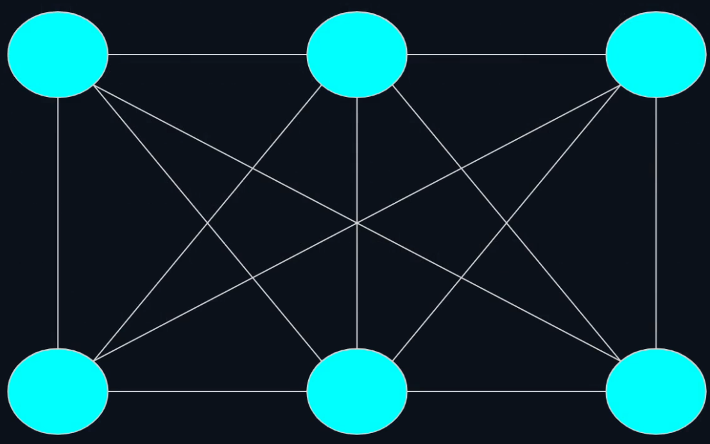
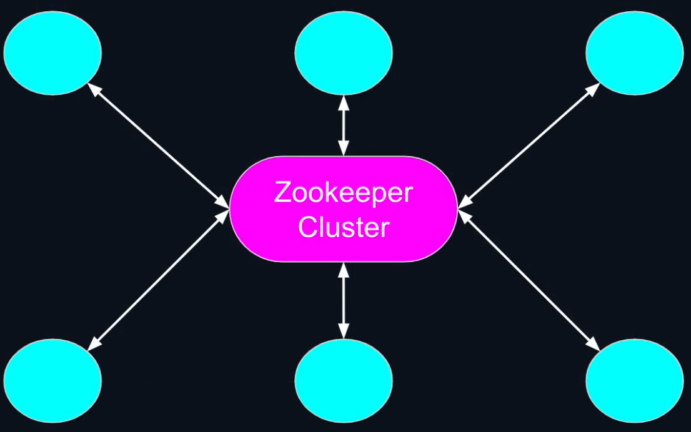
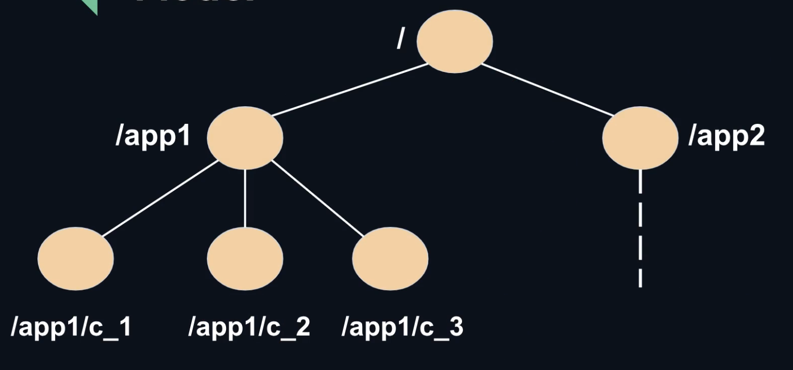
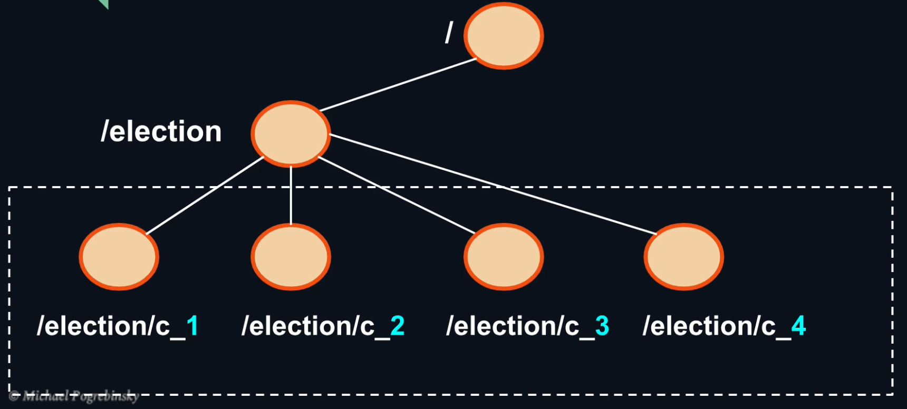
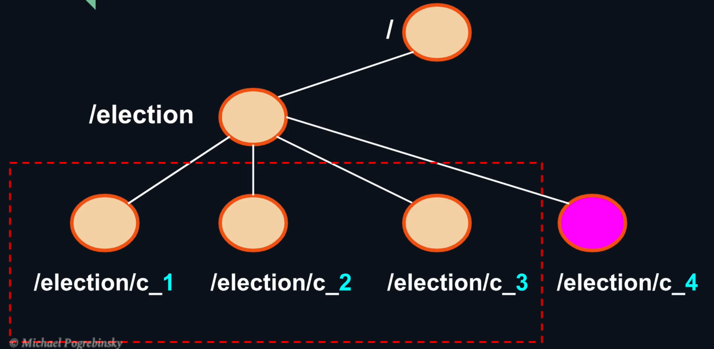
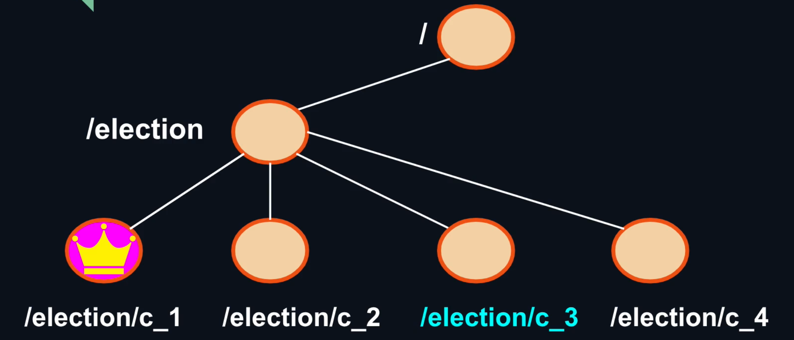
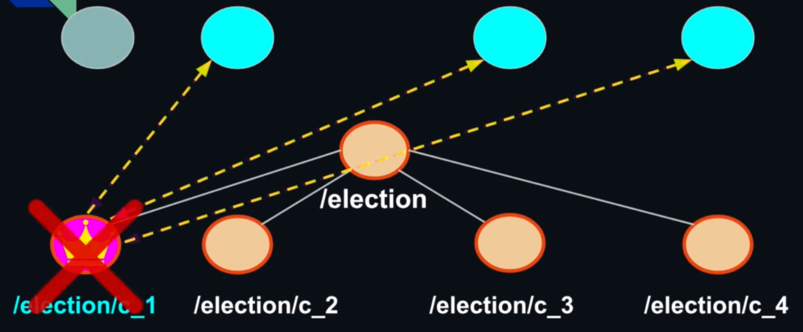
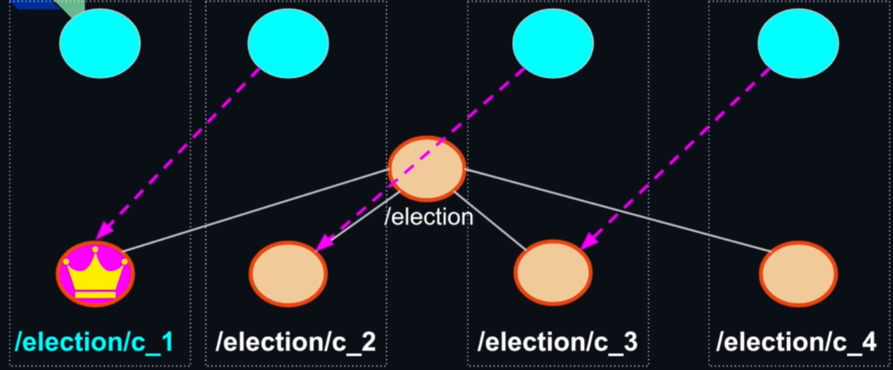
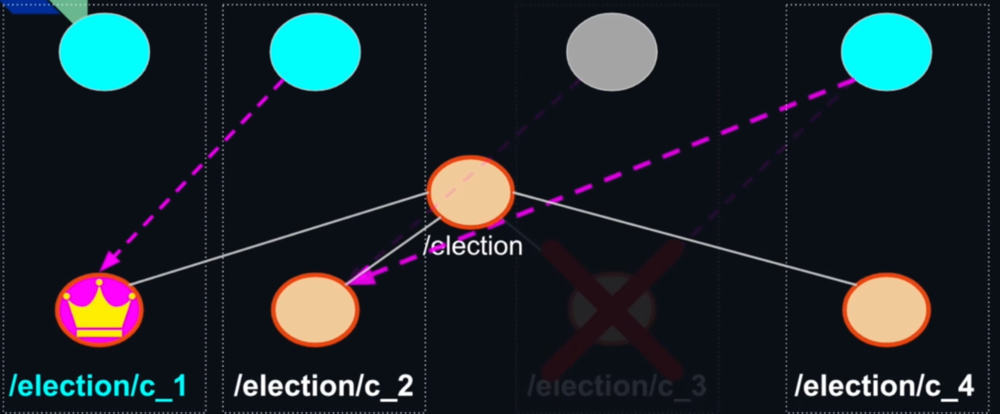

## Automatic Leader Election
- Automatic and System leader election is not a trivial task to solve, even among people.
- Arriving to an agreement on a leader in a large cluster of nodes is even harder.
- By default, each node knows only about itself, Service registry and discovery is required.
- Failure detection mechanism is necessary to trigger automatic leader reelection in a cluster.
- Implementing distributed algorithms for consensus and failover from scratch is hard, what we can do is using a high performance distributed system coordination service like **Apache Zookeeper**. 

**Zookeeper** is a high performance coordination service designed specifically for distributed systems. It is a popular technology used by many companies and projects like Kafka, Hadoop and HBase. It provides an abstraction layer for higher level distributed algorithms.
- It is a distributed system itself that provides us high availability and reliability.
- Typically runs in a cluster of an odd number of nodes, higher than 3.
- Uses redundancy to allow failures and stay functional.
Traditionally we have a topology like this one, where each node communicate to each other to coordinate the work:

But with Zookeeper, each node is going to communicate with the Zookeeper cluster:

Zookeeper provides an easy data abstraction that is a tree (similar to a filesystem), each element of the three is called **Znodes**:
- Hybrid between a file and a directory.
- Znodes can store any data inside (like a file.
- Znodes can have children znodes (like a directory).
- 2 types of Znodes:
	- Persistent—persists between sessions (if our application disconnect and reconnect to the cluster, it will find all the data in that Znode with the relative children).
	- Ephemeral—get delete as soon the application disconnect from the cluster (session ends). It is a great tool to verify if another node that create the Znode, went down.



## DESIGN AN ALGORITHM FOR LEADER ELECTION
1. Each node that connects to zookeeper cluster, propose itself as a leader. Each node submit its candidacy by adding a Znode that represent itself under the election parent. Since Zookeeper maintains a global order, each Znode is named according to the order of their addition.

   

2. After each node finishes creating a ZNode, it would query the current children of the election parent. Notice that because the order is guaranteed, each node when querying the children of the election parent, is guaranteed to see all the Znodes created prior to its own Znode

    

3. If the current node knows that it is the smallest number that it can see, it knows that it is the leader. This is how it **breaks the symmetry** and arrive to a global election of the leader node. When a node detects that its Znode doesn't have the lowest sequence number, it becomes the follower. Zookeeper guarantees a monotonically increasing, unique sequence number for each node that requests a sequence suffixed Znode.

   


## LEADER RE-ELECTION

### HEARD EFFECT

One possible solution in the eventuality that the leader fails is to watch the ephemeral ZNode associated with it,  and when it disappears, the other nodes start re-electing a new leader with the previous described algorithm.

This solution will work, but  it suffers of **Herd Effect** = A large number of nodes waiting for an event to occurs. When the event happens all nodes get notified, and they all wake up. Only one node can “succeed”. This indicates a bad design, can negatively impact the performance and can completely freeze the cluster, because they will start all the leader election process and bombard the Zookeeper Cluster with contemporary requests.

### POSSIBLE SOLUTION
Each node is going to watch only the ephemeral ZNodes that comes right before it in the sequence of candidate Znode. In this way if the leader dies the only node that is going to be notified is the immediate successor. That node will make sure that it owns the small sequence number checking the ZNodes children and in case becomes a leader.

If the notified node doesn't belong to the leader, it simplies close the gap in the chain watching the ZNode that is before the failed one.



## Zookeeper Client library's threading model

- Application's start code in the main method is executed on the main thread.
- When Zookeeper object is created, two additional threads are created:
	- Event Thread. It manages all the ZooKeeper's client state change events:
			- Connection (KeeperState.SyncConnected) to the ZooKeeper cluster.
			- Disconnection (KeeperState.Disconnected) from the ZooKeeper cluster.
			- Custom znode Watchers and triggers we subscribe to.
	
	- IO Thread. We don't interact with the IO Thread directly, the IO Thread is the one that handles all the network communication with ZooKeeper servers. It handles ZooKeeper requests and responses, responds to pings, session management, session timeouts etc.

## Watchers and Triggers

- getChildren(..., watcher) - Get notified when the list of a znode's children changes.
- Exists(znodePath, watcher) - Get notified if a znode gets deleted or created.
- getData(znodePath, watcher) - Get notified if a znode's data gets modified.
- public ZooKeeper(String connectString, int sessionTimeout, Watcher watcher) -  We use watchers when we create the zooKeeper object to handle the connection and disconnection event. The difference with the previous one is that the getChildren(), exists() and getData() are one-time triggers. So if we want to get future notifications, we need to register the watcher again.

## HOW TO LAUNCH IT

1. Download [ZooKeeper 3.7.1](https://www.apache.org/dyn/closer.lua/zookeeper/zookeeper-3.7.1/apache-zookeeper-3.7.1-bin.tar.gz) (important that it is 3.7.1 because tha maven pom file has the zooKeeper dependency that is compatible with this version) and extract it.
2. In the root directory of ZooKeeper create a folder called "logs" and copy the path.
3. Go in "conf" and rename "zoo.sample.cfg" in "zoo.cfg". 
4. Edit the field "dataDir" in the file "zoo.cfg"  adding the value from the step 2.
5. Go in the root directory and after in the "bin" one.
6. Run Zookeeper typing from terminal ```./zkServer.sh start``` if you are on Mac or Linux or use the .cmd.
9. Go in the leader-election root java project and type: ```mvn clean package``` 
10. Open as many terminal as you want (they will be nodes) and from the root of leader-election, type: ```java -jar target/leader-election-1.0-SNAPSHOT-jar-with-dependencies.jar```