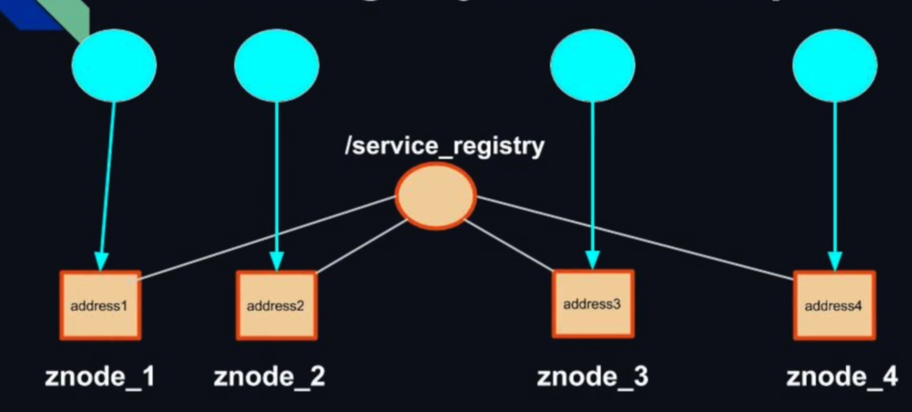
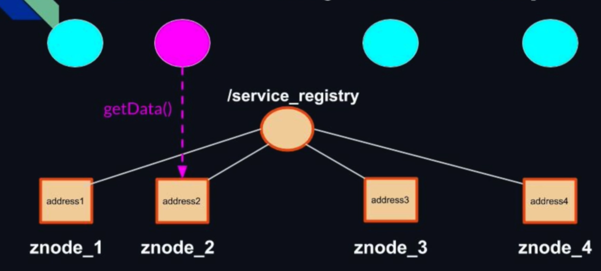

# SERVICE REGISTRY AND DISCOVERY

## Service Registry



## Service Discovery



## HOW TO LAUNCH IT

1. Download [ZooKeeper 3.7.1](https://www.apache.org/dyn/closer.lua/zookeeper/zookeeper-3.7.1/apache-zookeeper-3.7.1-bin.tar.gz) (important that it is 3.7.1 because tha maven pom file has the zooKeeper dependency that is compatible with this version) and extract it.
2. In the root directory of ZooKeeper create a folder called "logs" and copy the path.
3. Go in "conf" and rename "zoo.sample.cfg" in "zoo.cfg". 
4. Edit the field "dataDir" in the file "zoo.cfg"  adding the value from the step 2.
5. Go in the root directory and after in the "bin" one.
6. Run Zookeeper typing from terminal ```./zkServer.sh start``` if you are on Mac or Linux or use the .cmd.
9. Go in the service-registry-and-discovery root java project and type: ```mvn clean package``` 
10. Open as many terminal as you want (they will be nodes) and from the root of service-registry-and-discovery type: ```java -jar target/service-registry-and-discovery-1.0-SNAPSHOT-jar-with-dependencies.jar PORT``` (WHERE PORT IS DIFFERENT FOR EACH TIME IS LAUNCH ON A DIFFERENT TERMINAL ON THE SAME MACHINE e.g. 8080).