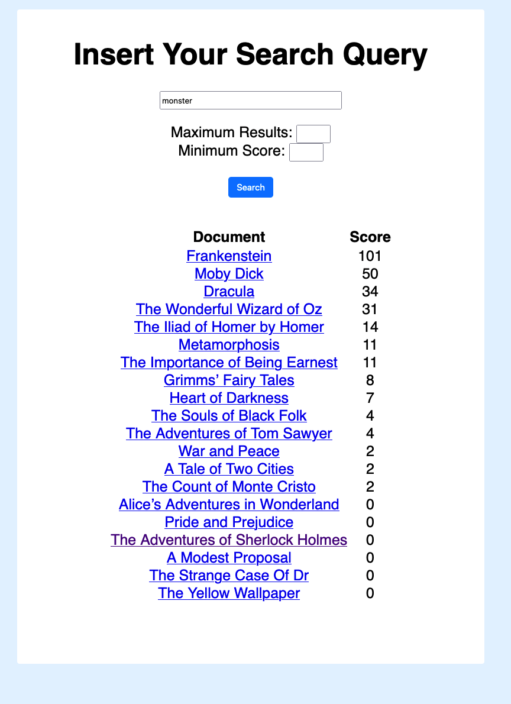
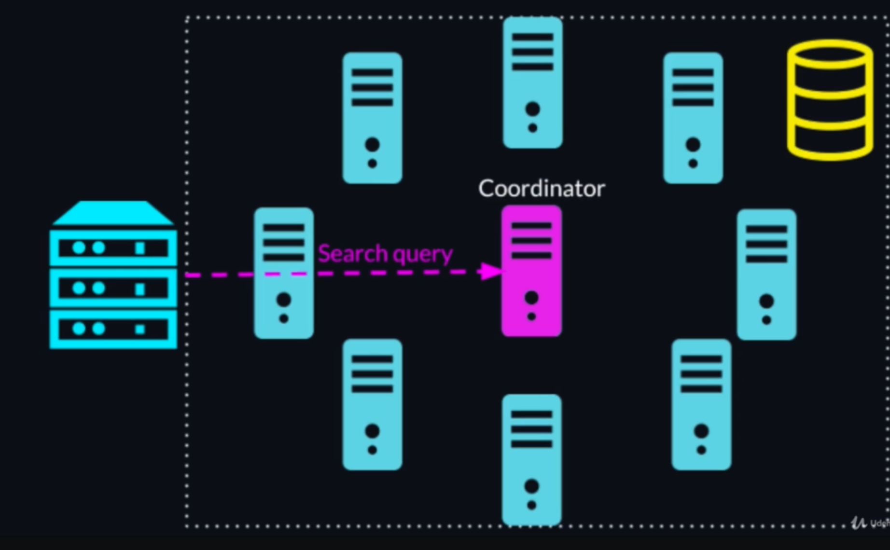
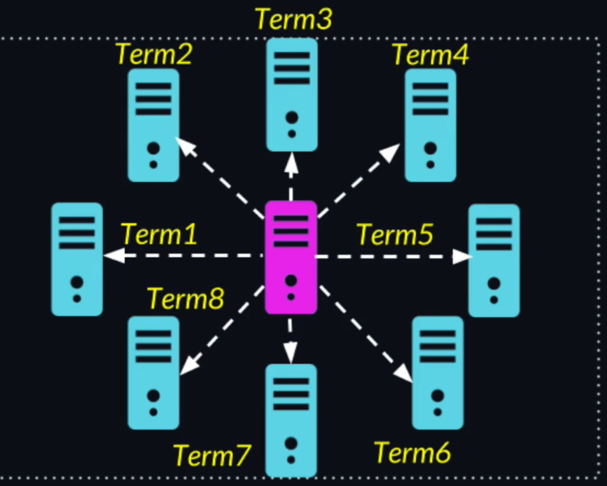
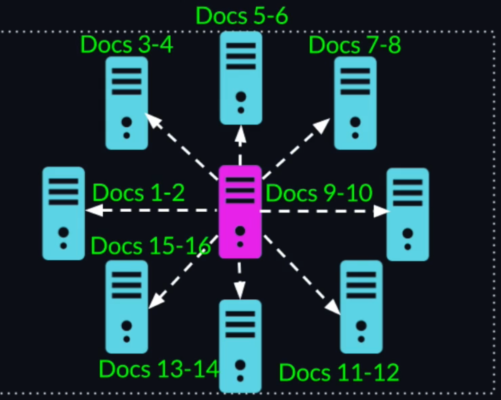
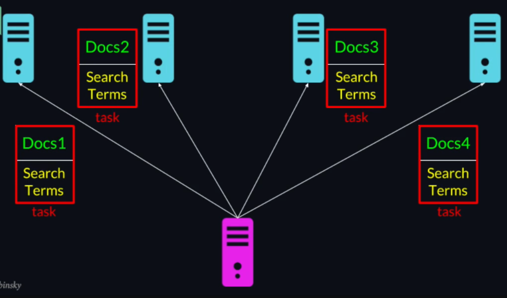
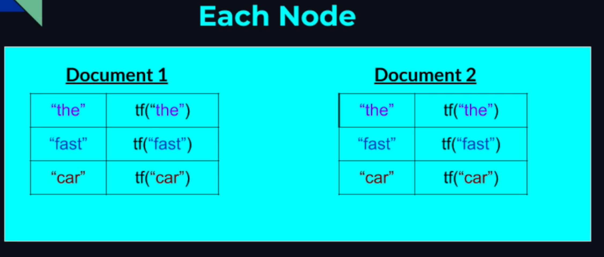
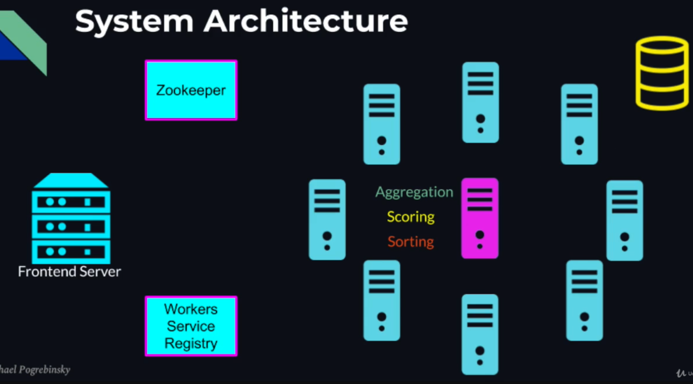

## END RESULT




## HIGH LEVEL ARCHITECTURE


## CLUSTER

### INPUTS
- We have a large number documents:
	- Books
	- Academic Articles
	- Legal Documents
	- Websites
	- ...
- Search Query from the user.

### OUTPUT
Most relevant documents to the user's search:
	- Doc 1 -> Most Relevant
	- Doc 2
	- Doc 3
	- ...
	- Doc N -> Least Relevant


## TF—IDF (Term Frequency  - Inverse Document Frequency ) Algorithm


### TF (TERM FREQUENCY)
A term is more likely to appear in big documents with many words (we can assume that in that case the term is not really relevant for the document if not appearing often). So to avoid this problem we can calculate TF as: 
```
TF = (term count in a document) / (total number of words in the document)
```

E.g.:
| Article about Cars (500 words document) | Long Book about Food (500000 words) |
| --------------------------------------- | ----------------------------------- |
| Term occurence = 50                     | Term Occurrence = 60                |
| TF = 0.1                                | TF = 0.00012                        |

### IDF
Measures how much information each term in the search query provides us: 
- Common terms that appear in many documents do not provide us any value, and get lower weight.
- Terms that are more rare across all documents, get higher weight.
This measure is called **Inverse document frequency (IDF)** and is calculated as:
```
idf(term) = log(N/ nt)
- N = Number of documents.
- nt = Number of documents containing the term.
```

So with a query like: "the fast car", we can calculate the relevance of document i as:
```
score(doc_i) = tf("the", doc_i) x idf("the") +
		       tf("fast", doc_i) x idf("fast") +
		       tf("car", doc_i) x idf("car")
In this way the term "the" that is likely to appear in all the documents will have idf = 0, so whatever value of TF x 0 = 0, this term has not meaning for the user search.
```

### SORT
At the end we sort the documents and get the list ordered by the most relevant for the user.

**NOTE**:

- TF-IDF is a statistical algorithm and requires a large enough set of documents to give good results (For instance if we have only 10 documents and all of them contain the word "car", the idf=0).
- The algorithm works well with high number of documents and is highly parallelizable, so it is a perfect fit for building a distributed system.
- TF-IDF is commonly used not only for search queries but also for grouping similar documents (feeding as a search query the entire document).

## HOW WE IMPLEMENT IT?

The user query the gateway server that query the leader of the cluster that parallelize the work among the workers of the cluster that do computation. Once done, the leader receives the result from the works, aggregate them and sends back to the gateway that redirects the result to the user.


### Data Partitioning
Problem Dimensions:
	- D - Number of Documents.
	- T - Number of Search Terms.

Once we found out the dimensions of the problem we need to decide on which dimension we want to parallelize the algorithm.
In our case we can either partition the problem by terms, giving to each node a subset of terms and all the documents:

OR
we can give to each node a subset of Documents and all the search terms:


**The decision on how to parallelize the algorithm is critical to make the algorithm scalable. We need to choose the dimension on which the input to our system is expected to grow the most.
In this way when and if the data does grow, then we can simply add more machines to the cluster, and the system will easily scale.**

SO:
- Do we expect the number of terms in the query to grow significantly ?  NO.
- Do we expect the number of documents to grow over time  ? YES.

**Then we choose to parallelize the TF-IDF algorithm by the documents.**


### PARALLEL ALGORITHM
- It is easy to calculate the TF, because is dependent on each single document.
- It is not easy to calculate the IDF (log(N / nt)) made of N - number of documents (we can know this number easily) and NT - (Number of documents containing the term, for this we need all the documents ).

**Let's define an algorithm in steps:**
1. The leader will take the search request parameter and split the documents among the nodes and send the full search terms to each of them.
2. Each Node will create a map for each document allocated to it. In this map we have the "search term" and the term frequency in the corresponding document.
3. Than each node will aggregate the map that it created for each document internally and send back to the leader. At this point the leader will have all the term frequency for all the documents.
4. The leader will calculate all the IDF for all the terms (easy, because the map already say if a term appears in the document, so only reading the map and addition required, scanning again documents NOT), will score the documents and sort the document by relevance.

### SYSTEM ARCHITECTURE
1. We use Zookeeper for the leader election that will act as coordinator.
2. Once the leader is elected, the workers nodes will register themselves to the workers service registry and the leader will pull those addresses so that can send tasks to those workers.
3. The leader will register itself in a different ZNode in the coordinators service registry to allow the frontend server to find its address.
4. Once the search query come to the frontend server as input, the frontend server will look for the leader's address in the coordinators service registry and forward the search query to the leader. 
5. The leader will inspect all the workers asking to the workers service registry and send to the workers through http all the tasks. 
6. Once a node receive the task it will read the documents from a server repository, perform the calculation and send back the result to the leader.
7. Once received all the results, the leader perform the final aggregation, scoring and sorting and send the result back to the upstream system.


## HOW TO LAUNCH IT

1. Download [ZooKeeper 3.7.1](https://www.apache.org/dyn/closer.lua/zookeeper/zookeeper-3.7.1/apache-zookeeper-3.7.1-bin.tar.gz) (important that it is 3.7.1 because tha maven pom file has the zooKeeper dependency that is compatible with this version) and extract it.
2. In the root directory of ZooKeeper create a folder called "logs" and copy the path.
3. Go in "conf" and rename "zoo.sample.cfg" in "zoo.cfg". 
4. Edit the field "dataDir" in the file "zoo.cfg"  adding the value from the step 2.
5. Go in the root directory and after in the "bin" one.
6. Run Zookeeper typing from terminal ```./zkServer.sh start``` if you are on Mac or Linux or use the .cmd.
7. Go in the distributed-search-frontend root java project and type: ```mvn clean package``` 
8. Write in the terminal ```java -jar target/front.end-1.0-SNAPSHOT-jar-with-dependencies.jar```
9. Go into the tf-idf root java project and type: ```mvn clean package``
10. Open as many terminal as you want (they will be nodes, and in this case you need at least 2) and from the tf-idf root type in each of them: ```java -jar target/tf-idf-1.0-SNAPSHOT-jar-with-dependencies.jar PORT``` change PORT with different ports for each terminal.
11. Go to http://localhost:9000/ and start querying the cluster!