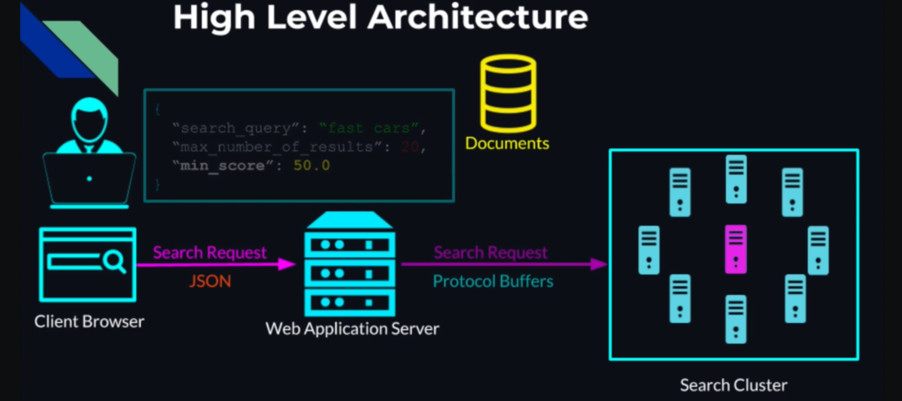

# DISTRIBUTED SEARCH

Repo based on this Udemy course: [Distributed Systems & Cloud Computing with Java](https://www.udemy.com/course/distributed-systems-cloud-computing-with-java/).

**In each folder, you can find an appropriate README explaining the motivation/ algorithm and how to launch the code.**

##  

## REPO STRUCTURES

**This repo structure is a walkthrough of basic concepts and principles in a direction of creating a distributed search system:**

1. 1.leader-election: Algorithm for the leader election in a cluster of nodes (breaking the symmetry) that can act as coordinator to process different tasks.
2. 2.service-discover-registry: Using the addresses published in the service registry we can establish the communication within the cluster. That is done in project number 3 to connect different nodes to perform a search document-based in a distributed system.
3. 3.document-search: Thanks to the previous two repositories, we arrive at the implementation of an algorithm for document search in a distributed cluster (TF—IDF (Term Frequency - Inverse Document Frequency).